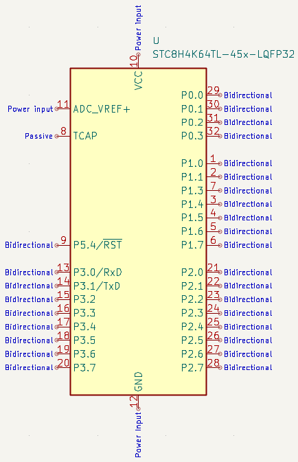

# KiCad Symbols for STC Microcontrollers

STC, or Shenzhen Guoxin Artificial Intelligence Co., Ltd. as in the [STC8H datasheet](http://www.stcmcudata.com/STC8F-DATASHEET/STC8H-EN.pdf), is a Chinese manufacturer of mainly 8051-compatible microcontrollers. Their STC15 and STC8 series feature pipelined code execution, large flash and RAM, and peripherals such as SPI, I²C, A/D and PWM, with DMA and USB in high-end models.

As of September 2022, the [MCU_STC library](https://kicad.github.io/symbols/MCU_STC) in KiCad contains only the STC15W204S and its variants. The libraries here are intended as a more comprehensive replacement for MCU_STC.

## Library Organisation

To reduce repetition, These libraries contain only the highest-memory-capacity non-IAP model in each series. They should be sufficient as chips in each series differ only by memory size and rarely have functional differences. “IAP” model names are not used because they deviate from the normal naming and can be distracting.

Chips with very low sales or no stock on LCSC have not been included as they are unlikely to be used.

Where the same chip has more than one package with the same pinout, LQFP and SOP are included, and DFN/QFN and DIP are omitted. If you wish to use one of the omitted packages, simply edit the Footprint field after placing the symbol.

## Symbol Design

All symbols in these libraries are 1000 mil wide.

Following the style of KiCad’s AVR and STM32 libraries, GPIO ports are placed clockwise from the top-right corner of the symbol and pins within each port are ordered top-to-bottom. Unlike in those libraries however, a port near the bottom of the symbol is never split between the left and right for compactness; I prefer that each port remains a whole, even if it means a bit more empty space at the top-left.

Non-GPIO pins are placed at the top-left corner of the symbol, for example `ADC_VREF+`, and `TCAP` in chips with capacitive touch. `ADC_VREF+` is shifted down to avoid 

GPIO pins are labelled with port and bit numbers only, except for `RST`, and the UART1 pins for programming and debugging, as they are always important. For all other pins, it would be too much visual noise to include all their alternate functions. The user is expected to either edit the pin names to include alternate functions used, or use net labels to indicate the purpose of pins.